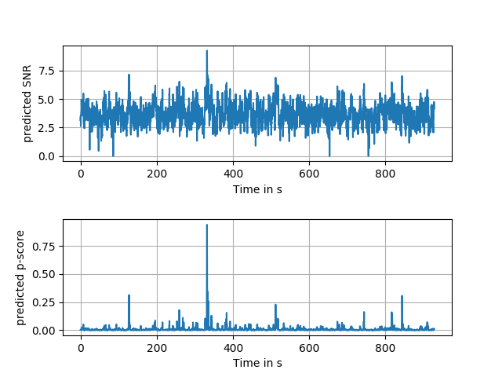

# Detection of gravitational-wave signals from binary neutron star mergers using machine learning
Marlin B. Schäfer<sup>1, 2</sup>, Frank Ohme<sup>1, 2</sup>, Alexander H. Nitz<sup>1, 2</sup>

 <sub>1. [Albert-Einstein-Institut, Max-Planck-Institut for Gravitationsphysik, D-30167 Hannover, Germany](http://www.aei.mpg.de/obs-rel-cos)</sub>  
 <sub>2. Leibniz Universitat Hannover, D-30167 Hannover, Germany</sub>

## Introduction
As two neutron stars merge, they emit gravitational waves that can potentially be detected by earth bound detectors. Matched-filtering based algorithms have traditionally been used to extract quiet signals embedded in noise. We introduce a novel neural-network based machine learning algorithm that uses time series strain data from gravitational-wave detectors to detect signals from non-spinning binary neutron star mergers. For the Advanced LIGO design sensitivity, our network has an average sensitive
distance of 130 Mpc at a false-alarm rate of 10 per month. Compared to other state-of-the-art machine learning algorithms, we find an improvement by a factor of 6 in sensitivity to signals with signal-to-noise ratio below 25. However, this approach is not yet competitive with traditional matched-filtering based methods. A conservative estimate indicates that our algorithm introduces on average 10.2 s of latency between signal arrival and generating an alert. We give an exact description of our testing procedure, which can not only be applied to machine learning based algorithms but all other search algorithms as well. We thereby improve the ability to compare machine learning and classical searches.

This repository contains three files and an image. It is supplementary material to [`[1]`](#publication). The contents of the files can be summarized as:
 * The trained neural network is stored in the file 'network.hdf' and can be loaded by [Keras](https://keras.io/).
 * The module 'test_data.py' contains a function which generates two [hdf files](https://www.hdfgroup.org/). The first file stores simulated data for the two gravitational wave detectors in Hanford and Livingston, where many gravitational-wave signals were added into the noise background. The second file contains information about the location in time and the parameters of these additive signals.
 * The file 'network_application_example.py' is an example-script that explains how to apply the network to data. It generates 1024s of mock data and uses the network to estimate the signal-to-noise ratio and the p-score over this range.


## Generating test data
To generate a mock gravitational-wave data set, we provide a function called 'generate' within the 'test_data.py' module. To use it from the command line navigate to the folder where the module is contained and open a terminal where the [required packages](#Requirements) are accessible. An example usecase would be
```
>>> from test_data import generate
>>> file_name = 'example_file.hdf'
>>> duration = 1024
>>> generate(file_name, duration)
```
This would generate two files names 'example_file.hdf' (1) and 'example_file_stats.hdf' (2) in the working directory.
Note that the file name must end in '.hdf'!
File (1) contains the strain data for the two detectors Hanford and Livingston. To access the data use the 'load_timeseries' function from [PyCBC](https://pycbc.org/).
```
>>> from pycbc.types import load_timeseries
>>> hanford_data = load_timeseries('example_file.hdf', group='H1')
>>> livingston_data = load_timeseries('example_file.hdf', group='L1')
```
File (2) contains the timestamps and parameters of every injected signal. The parameters are drawn from distributions given in table 1 of [`[1]`](#publication). The contents can be read using an Python environment and [h5py](https://www.h5py.org/). For example
```
>>> import h5py
>>> fp = h5py.File('example_file_stats.hdf', 'r')
>>> injection_times = fp['times'][()]
>>> fp.close()
```
Possible keys are
 * `cphase`: The coalescence phase of the signal.
 * `dec`: The declination of the signal (in radians).
 * `dist`: The luminosity distance of the signal (in Mpc).
 * `inc`: The inclination of the emitting system (in radians).
 * `mass1`: The source-frame mass of the larger object (in solar masses).
 * `mass2`: The source-frame mass of the smaller object (in solar masses).
 * `pol`: The polarization angle of the gravitational wave.
 * `ra`: The right ascension of the signal (in radians).
 * `seed`: The seed used to generate the noise background.
 * `times`: The time in seconds from the start of the data-segment where the signal begins.

## Applying the network
An example of how to apply the network to some gravitational-wave data is given in 'network_application_example.py'. To run the example, navigate to the directory where the script is stored and open a terminal where the [required packages](#Requirements) are accessible. To execute it type
```
python network_application_example.py
```
The script will check if mock-data named 'example_injections.hdf' exists within the working directory. If it does not find such a file it will generate 1024 seconds of mock-data using the generate function of the test_data module described [above](#Generating-test-data). It will then continue to load that data and create a [Keras](https://keras.io/) generator from it. The generator slices the time series into chunks of duration 32 seconds, with a stride of 0.25 seconds. Each chunk is whitened and re-sampled as detailed in [`[1]`](#publication). The generator is a class called 'time_series_generator' contained in the same file and takes any number of time series of equal duration and sample rate as input. It will slice all time series equally.
The generator is used to apply the network to the data using a sliding window. It is passed alongside the network to the function 'evaluate_ts_from_generator' also contained in the same file. This function applies the network and returns two time series, one interpreted as containing an estimate of the signal-to-noise ratio at every window position and one interpreted as containing a p-score at every window position. Finally, the two time series are saved to files named 'snr_time_series.hdf' and 'p-score_time_series.hdf', the results are plotted and the graphs are stored to a file named 'example_results.png'. The resulting plot should look the same or similar to the plot shown below.

This script explicitly does not generate events. To generate events, one would need to apply a threshold and cluster the positions that exceed the given threshold as detailed in [`[1]`](#publication).

## Requirements
All code was created and tested with the following software configuration:
 * virtualenv version 16.1.0
 * Python 2.7
 * PyCBC version 7c813d
 * LAL version 6.19.0
 * Keras version 2.2.4
 * Keras backend Tensorflow version 1.12.0 (CPU)
 * Numpy version 1.15.4
 * h5py version 2.8.0
 * Matplotlib version 2.2.3

## References
<a name="publication"></a>`[1]`: [Detection of gravitational-wave signals from binary neutron star mergers using machine learning](https://arxiv.org/abs/)
